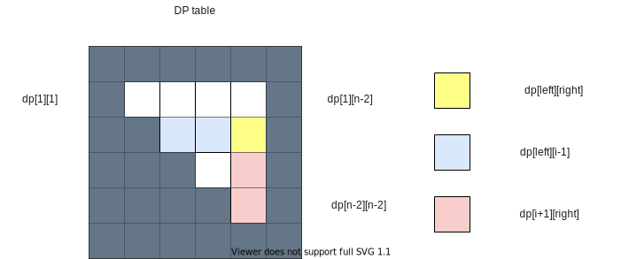
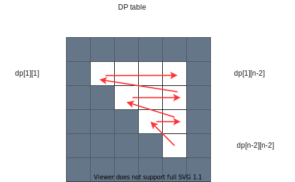

## 973. K Closest Points to Origin

1. the top k problem then we have pq, the difficult part is to write custom pq declaration/sorter
2. we need top k, but not top k sorted, so we could use quick select to partition the array into smaller than k, and bigger than k. 

```cpp
class Solution {
public:
    vector<vector<int>> kClosest(vector<vector<int>>& points, int k) {
        auto sortByDis = [](const auto& p1, const auto& p2){
            int d1 = p1[0] * p1[0] + p1[1] * p1[1];
            int d2 = p2[0] * p2[0] + p2[1] * p2[1];
            return d1 > d2;
        };
        
        priority_queue<vector<int>, vector<vector<int>>, 
                       decltype(sortByDis)> pq(points.begin(), points.end(), sortByDis);
        // for (auto& p: points) {
        //     pq.push(p);
        // }
        vector<vector<int>> ans;
        while (k--) {
            ans.push_back(pq.top());
            pq.pop();
        }
        return ans;
    }
    
    vector<vector<int>> kClosest(vector<vector<int>>& points, int k) {
        auto sortByDis = [](const auto& p1, const auto& p2){
            int d1 = p1[0] * p1[0] + p1[1] * p1[1];
            int d2 = p2[0] * p2[0] + p2[1] * p2[1];
            return d1 < d2;
        };
        //n_th element is the quick select
        nth_element(points.begin(), points.begin() + k, points.end(), sortByDis);
        return vector<vector<int>>(points.begin(), points.begin() + k);
    }
};
```

## 476. Number Complement
1. xor will flip a bit, so we could xor each bit using right shift `>>` and left shift `<<`
2. how about construct a 111 bitmask and do the xor in one shot? log(x)/log2 + 1, then `(1 << n) - 1` 
3. highestOneBit from hacker's delight. same 1 bit bitmask from 1->2->4->8->16 for 32 bit integer.

what about 0? #1009
```cpp
class Solution {
public:
    int findComplement(int num) {
        int todo  = num, bit = 1;
        while (todo != 0) {
            num = num ^ bit;
            bit = bit << 1;
            todo = todo >> 1;
        }
        return num;
    }
};

class Solution {
public:
    int findComplement(int num) {
    // n is a length of num in binary representation
    int n = (int)( Math.log(num) / Math.log(2) ) + 1;
    // bitmask has the same length as num and contains only ones 1...1
    int bitmask = (1 << n) - 1;
    // flip all bits
    return bitmask ^ num;
  }
}

class Solution {
public:
    int findComplement(int num) {
    // bitmask has the same length as num and contains only ones 1...1
    int bitmask = num;
    bitmask |= (bitmask >> 1);
    bitmask |= (bitmask >> 2);
    bitmask |= (bitmask >> 4);
    bitmask |= (bitmask >> 8);
    bitmask |= (bitmask >> 16);
    // flip all bits 
    return bitmask ^ num;
  }
}

```

## 876. Middle of the Linked List

it is always the mid_right

```cpp
class Solution {
public:
    ListNode* middleNode(ListNode* head) {
        ListNode* slow = head;
        ListNode* fast = head;
        while (fast && fast->next) {
            slow = slow->next;
            fast = fast->next->next;
        }
        return slow;
    }
};
```
## 116. Populating Next Right Pointers in Each Node

1. most straight forward is level bfs
2. follow up, how to do it in constant time, then it must be recursive
3. 只有一个点是不能做到的，必须一次看三个点
4. 一个办法是一次进两个， postorder左右之后在连起来， 好处是order随意
5. 只用一个也可以，但是得是postorder

```cpp
class Solution {
public:
    Node* connect(Node* root) {
        if (!root) return root;
        queue<Node*> q;
        q.push(root);
        while (!q.empty()) {
            int size = q.size();
            while (size--){
                Node* cur = q.front(); q.pop();
                cur->next = (size > 0) ? q.front(): nullptr;
                if (cur->left) q.push(cur->left);
                if (cur->right) q.push(cur->right);
            }
        }
        return root;
    }
};
    
class Solution {
public:
    Node* connect(Node* root) {
        if (!root) return nullptr;
        connect(root->left, root->right);
        return root;
    }
    
    void connect(Node* left, Node* right){
        if (!left || !right) {
            return;
        }
        //order don't matter
        //o(2n)  7node=>13
        left->next = right;
        connect(left->left, left->right);
        connect(right->left, right->right);
        connect(left->right, right->left);
    }
};

class Solution {
public:
  Node* connect(Node* root) {
    if (!root || !root->left) return root;
    
    if (root->next)
      root->right->next = root->next->left;
    root->left->next = root->right;
       
    connect(root->right);
    connect(root->left);
   
    return root;
  }
};
```

## 1015. Smallest Integer Divisible by K

* there is at most K remider possible, so the loop only need K time
* By the rules of modular arithmetic (a * b + c) mod m is same as ((a * b) % m + c % m) % m.
* anything diviable by 2 or 5 is impossible to end with 1


```cpp
class Solution {
public:
    int smallestRepunitDivByK(int k) {
        int r = 0;
        for (int i = 1; i <= k; i++) {
            r = (r * 10 + 1) % k;
            if (r == 0) return i;
        }
        return -1;
    }
};
```

## 1026. Maximum Difference Between Node and Ancestor

what else information we need besides the minmax result? the max abs diff from root to min or max

```cpp
struct Result {
    int maxDiff = 0;;
    int minVal = INT_MAX;
    int maxVal = INT_MIN;
};
class Solution {
public:
    int maxAncestorDiff(TreeNode* root) {
        return helper(root).maxDiff;
    }
    
    Result helper(TreeNode* root) {
        if (!root) return {0, INT_MAX, INT_MIN};
        Result left = helper(root->left);
        Result right = helper(root->right);
        int minVal = min({root->val, left.minVal, right.minVal});
        int maxVal = max({root->val, left.maxVal, right.maxVal});
        int maxDiff = max({left.maxDiff, right.maxDiff,
                          abs(root->val - minVal), 
                          abs(maxVal - root->val)});
        return {maxDiff, minVal, maxVal};
    }
};
```

## 312. Burst Balloons

1. padding the input 1 + A + 1, and start dfs on (1, n-2)
2. for any moment, left-1, [left...i...right], right + 1
3. (left - 1) * i * (right+1) is the score for current pop
4. but we still need to count in the subproblem [left...i-1] and [i+1,...right]
5. memo is easy, can you do do bottom up? what's the cache pattern?





```cpp
class Solution {
public:
    int maxCoins(vector<int>& nums) {
        vector<int> input{1};
        input.insert(input.end(), nums.begin(), nums.end());
        input.push_back(1);
        int n = input.size();
        vector<vector<int>> memo(n, vector<int>(n));
        return burst(input, 1, n-2, memo);
    }
    
    int burst(vector<int>& nums, int left, int right, vector<vector<int>>& memo) {
        if (left > right) return 0;
        if (memo[left][right] > 0) return memo[left][right];
        int ans = 0;
        for (int i = left; i <= right; i++) {
            int cur = nums[left-1] * nums[i]* nums[right+1] +
                      burst(nums, left, i-1, memo) + 
                      burst(nums, i+1, right, memo);
            ans = max(ans, cur);
        }
        return memo[left][right] = ans;
    }
};
```

## 1244. Design A Leaderboard
1. the most easy way is to using a min pq to get the top sorted top k, O(nlogk)
2. is to use a quick partition to get top k, O(n)
3. or using a bst, bump other ops to log(n), and top k is also just O(k)

```cpp
class Leaderboard {
    unordered_map<int,int> id_score;
    multiset<int, greater<int>> bst;
public:
    Leaderboard() {
    }
    
    void addScore(int playerId, int score) {
        auto it = bst.find(id_score[playerId]);
        if (it != bst.end()){
            bst.erase(it);
        }
        id_score[playerId] += score;
        bst.insert(id_score[playerId]);
        
    }
    
    int top(int K) {
        int ans = 0;
        auto it = bst.begin();
        while(K--){
            ans += *it;
            it++;
        }
        return ans;
    }
    
    void reset(int playerId) {
        auto it = bst.find(id_score[playerId]);
        if (it != bst.end()){
            bst.erase(it);
        }
        id_score[playerId] = 0;
    }
};
```

## 2127. Maximum Employees to Be Invited to a Meeting

找环，只有两个的是pair，剩下的只能在入的edge里面选一个，不是每个点都是可以选两个的，最大的子树问题变成最长的子树问题
如果是大于两个的环，这个环deadlock小团体，要么上，要么全不上

```cpp
class UnionFind {
public:
    UnionFind(int n):count_(n) {
        parent.resize(n);
        rank.resize(n);
        for (int i = 0; i < n; i++) {
            parent[i] = i;
            rank[i] = 1;
        }
    }
    
    int find(int x) {
        if (parent[x] == x) {
            return x;
        }
        return parent[x] = find(parent[x]);
    }
    
    bool connect(int a, int b) {
        int ra = find(a);
        int rb = find(b);
        if (ra == rb) return false;
        if (rank[ra] < rank[rb]) {
            parent[ra] = rb;
            rank[rb] += rank[ra];
        } else {
            parent[rb] = ra;
            rank[ra] += rank[rb];
        }
        count_--;
        return true;
    }
    
    int count() {
        return count_;
    }
    // size of scc
    int size(int i) {
        return rank[find(i)];
    }
    
private:
    vector<int> parent, rank;
    int count_;
};

class Solution {
public:
    int maximumInvitations(vector<int>& adj) {
        int N = adj.size();
        vector<int> indegree(N);
        for (int i = 0; i < N; i++) {
            indegree[adj[i]]++;
        }
        
        vector<int> depth = topo(N, adj, indegree);
        //union cycle
        UnionFind uf(N);
        for (int i = 0; i < N; i++){
            if (indegree[i]) {
                uf.connect(i, adj[i]);
            }
        }
        
        //cycle or two arms
        int duoCount = 0;
        int maxCycleSize = 0;
        for (int i = 0; i < N; i++) {
            if (indegree[i] == 0) continue;
            int cycleSize = uf.size(i);
            if (cycleSize == 2) {
                int j = adj[i];
                indegree[j]--;//don't recounting
                duoCount += (depth[i] + depth[j]);
            }
            maxCycleSize = max(maxCycleSize, cycleSize);
        }
        return max(maxCycleSize, duoCount);
    }
    
    vector<int> topo(int N, vector<int>& adj, vector<int>& indegree) {
        vector<int> depth(N, 1);
        queue<int> q;
        for (int i = 0; i < N; i++) {
            if (indegree[i] == 0) {
                q.push(i);
            }
        }
        while (!q.empty()) {
            int v = q.front(); q.pop();
            int c = adj[v];
            depth[c] = max(depth[c], depth[v] + 1); //largest possible non-cyclic path up to node 'c'
            indegree[c]--;
            if (indegree[c] == 0) {
                q.push(c);
            }
        }
        return depth;
    }
};
```