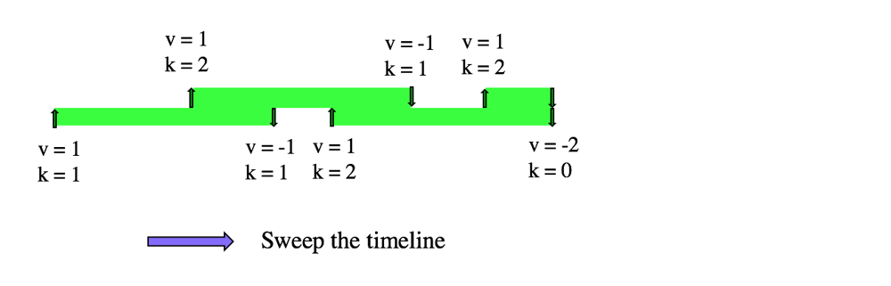

## Sweep time line
和刚刚的diff问题一样，只是问题颗粒不在是每个index， 而是index of interest, 在输入sparse的情况下避免了一秒一秒的数，而是event发生了再处理， 利用了bst的里面的key也是sorted的特性



用map的思路再来解 `1109. Corporate Flight Bookings` 和 `1094. Car Pooling` 区别在于， 1109: 定义为[i,j]. j时还没有下，j+1才算下车; 1094: 定义为[i,j) 在j已经下车了

```cpp
class Solution {
    vector<int> corpFlightBookings(vector<vector<int>>& bookings, int n) {
        map<int,int> timeline;
        for (auto& b: bookings) {
            int i = b[0], j = b[1], v = b[2];
            timeline[i] += v;
            timeline[j+1] -= v;
        }
        vector<int> ans(n);
        ans[0] = timeline[1];
        for (int i = 1; i < n; i++) {
            ans[i] = ans[i-1] + timeline[i+1];
        }
            
        return ans;
    }
};

class Solution {
public:
    bool carPooling(vector<vector<int>>& trips, int capacity) {
        map<int, int> timeline;
        for (auto trip: trips) {
            int val = trip[0], i = trip[1], j = trip[2];
            timeline[i] += val;
            timeline[j] -= val;
        }
        int count = 0;
        int ans = 0;
        for (auto&[e, c]: timeline) {
            count += c;
            ans = max(ans, count);
        }
        return ans <= capacity;
        
    }
};
```
利用这个sweep line只记录diff的思想 可以解决一系列的meeting rooms/ My calendar/intervals问题
## 空间换时间
是不是和LRU, LFU里面的普通解法bst到bucket of linked list 一个意思？ 都是一旦确定了range，则可以用bucket sort的思想把BST继续压平。利用空间换时间。

# 再看看meeting rooms系列
## 252. Meeting Rooms and 253. Meeting Rooms II
最直观的是也可以用sort by start，然后检查是否conflict的方式来做 I 但是同样的思路解II就那么容易，不如sweep line简便

```cpp
class Solution {
public:
    bool canAttendMeetings(vector<vector<int>>& intervals) {
        sort(intervals.begin(), intervals.end());
        for (int i = 1; i < intervals.size(); i++) {
            int lastEnd = intervals[i-1][1];
            int curStart = intervals[i][0];
            if (lastEnd > curStart) return false;
        }
        return true;
    }
    
    bool canAttendMeetings(vector<vector<int>>& intervals) {
        map<int,int> timeline;
        for (auto e: intervals) {
            timeline[e[0]]++;
            timeline[e[1]]--;
        }
        int rooms = 0;
        int ans = 0;
        for (auto [e, room]: timeline) {
            ans = max(ans, rooms += room);
        }
        return ans <= 1;
    }
};
```

# 再看 My Calendar系列
## 729. My Calendar I
核心就用理由bst对start排序，找到start前一个和后一个
两个都不能conflict

```cpp
class MyCalendar {
    //prev  next
    //---| |---
    //  s---e
    //overlap: s < prev.end or e > next.start
public:
    MyCalendar() {}
    bool book(int start, int end) {
        auto next = books.lower_bound(start);
        if (next != books.end() && next->first < end) return false;
        if (next != books.begin() && start < prev(next)->second) return false;
        books[start] = end; 
        return true;
    }
private:
    map<int,int> books;
};
```

但是万一要求的是可以有double booking，但是不能triple.怎么办？
这就得用sweep line了，book失败就revert之前的基数
## 731. My Calendar II
```cpp
class MyCalendarTwo {
    map<int, int> bookings;
public:
    MyCalendarTwo() {}
    
    bool book(int start, int end) {
        bookings[start]++;
        bookings[end]--;
        int maxBooking = 0;
        int curBooking = 0;
        for (auto& [e, val]: bookings) {
            maxBooking = max(maxBooking, curBooking += val);
            if (maxBooking > 2) {
                bookings[start]--;
                bookings[end]++;
                return false;
            }
        }
        return true;
    }
};
```

## 732. My Calendar III
直接求的就是最大值
```cpp
class MyCalendarThree {
public:
    MyCalendarThree() {
        
    }
    
    int book(int start, int end) {
        bookings[start]++;
        bookings[end]--;
        int maxBooking = 0;
        int curBooking = 0;
        for (auto& [e, val]: bookings) {
            maxBooking = max(maxBooking, curBooking += val);
        }
        return maxBooking;
    }
private:
    map<int,int> bookings;
};
```


TODO
## https://leetcode.com/problems/merge-intervals/description/

## https://leetcode.com/problems/insert-interval/description/

## 759. Employee Free Time

