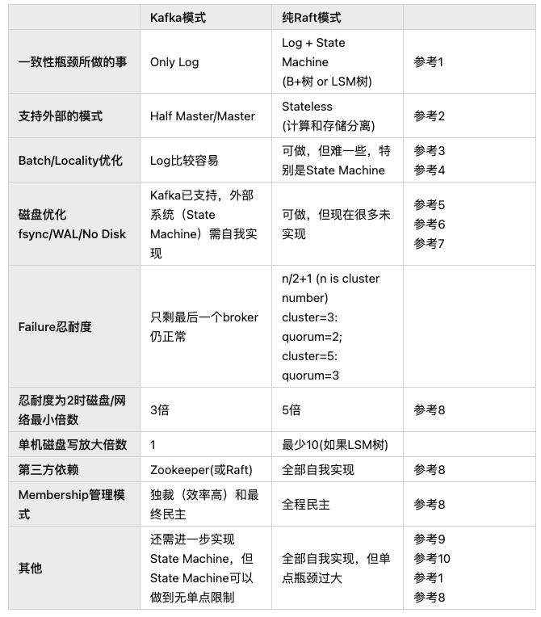

from https://zhuanlan.zhihu.com/p/399639015

# 1. 分布式下一致性Consistency的代价cost

## 前言

分布式是个好东西，有了分布式这个东西，我们希望达到：

1. HA, High Availability，高可用性，即如果有一个机器死了，没事，集群里还有另外一个兄弟（而且是双胞胎兄弟，因为有一样的数据）机器顶上

2. Scale-Out，横向扩展，即如果集群一台机器能服务1万个并发客户Client，那么万一来了两万个客户怎么办？简单，再增加一台机器即可

但上面美好的分布式系统的理想，在一致性Consistency的要求下，是有代价cost的，甚至有巨大约束Constraint。

## 什么叫分布式下的一致性

### 数据变化在分布式下的麻烦

打个比方，我在上海开始工作，只有一张银行卡，作为工资卡，上班前，里面有余额100人民币大元，本月工作结束，老板发给我400元月工资（老板好慷慨啊，发的一个月工资是我以前积蓄的四倍！）并存到这个这张卡上，然后老板进一步地照顾我，让我无限期的休假（开除了...）。

为了庆祝此事，我决定到广州去旅游一天，并住了一夜二百五的五星级高级酒店。我认为这没有什么，花掉一个二百五，我还剩下一个二百五。

但我总不希望，我在上海看到银行卡里有五百元，到了广州，却只能看到银行卡里只显示之前的积蓄一百元。即上海增加的数字，只能在上海的银行系统里看得到，到了广州，就看不到了。

这会导致我的信誉破产，至少是人格不稳定吧。

所以，我们希望：分布式系统里，各个机器的数字都一样。一处变化，全局生效。

上面问题很好解决，在上海和广州之间架设一个通信线路，将上海增加的工资数字，也发送给广州的银行系统。

### 数据变化并发时的麻烦

但如果两个地方有并发，就会有麻烦。

比如：我在上海给自己改个名字，叫Tony，然后在广州也给自己改个名字，叫Money。两边同时一起提交申请（假设我克隆了一个自己或者恶作剧，用上自己的孪生兄弟）。

如果上海人名办公室，先将我的名字设置为Tony，然后将这个名字发给广州，广州的也是如此操作，那么我在上海，最后名字会被叫做Money，而在广州，就变成了Tony。未来我拿着一个新的身份证，总有一个地方让我无法住店。

解决方案也有：就是要设置一个中心裁决点，比如北京最高人名办公室。上海和广州都向北京汇报我的改名请求，让北京来裁决。

如果北京先收到上海的请求，然后才收到广州的请求，那么我最终的名字就是Money。反之，就是Tony。

然后北京把这个最终决定，通过一次或两次信函（看两个请求到达北京时间间隔决定，如果同天到达，那么一封信函即可），告诉上海和广州，那么，我的名字的冲突问题就得到彻底地解决。

所以，结论：**对于并发，在分布式系统里，需要一个单点的中心裁决者，leader，来解决冲突。**

其本质在于：由于几方通信的随机性（因为TCP/IP通信是Async的，但TCP在一个连接上是有序ordered的），我们无法在整个系统里，依靠每个机器自己看到的顺序性，来决定整个系统的逻辑的唯一正确性（顺序性）。我们只能用一个单点(leader or master)，根据leader看到的顺序性，来作为整个分布式集群的顺序的一致性。

### 脑裂Brain Split的麻烦

上面还不是分布式仅有的麻烦。我们还有新的麻烦，叫脑裂Brain Split。

还是上面这个改名的案例，如果改名的最终判定权，属于北京最高人名办公室的张主任，但他可能偶有不适，比如修个产假。那么北京张主任不能工作的这段时间，我的改名就无法及时完成，这对于工作效率是不可接受的。

解决方法也有：就是如果北京的张主任病了，那么马上将裁决权转到上海的马主任。而且我们假设两位主任不太可能发生同时休产假，这样就保证了整个系统的有效性Availablility和健壮性HA。

怎么知道北京的张主任不能工作了（因为有可能是北京和上海以及广州的通信因为意外中断了）？在分布式系统里，是由上海和广州等待一个Timeout。如果发现Timeout里没有北京的任何动静（平时在Timeout时间还没有到，要求经常互相打个招呼，说声“我没死”，即发送HeartBeat消息），就认为北京已经网络隔离Network partition。然后由上海和广州一起决定，让上海作为新的裁决者leader。

但问题又来了，北京的张主任恢复很快，在我的最终结果还没有出来，他就回到办公室（或者根本就没有病，只是北京的通信恢复了），而且，他不知道裁决权已经转到上海马主任（记住：前面描述过，由于北京的通信中断，现在刚刚恢复，张主任不可能知道刚发生的上海和广州的leader选举）。这时，就出现了某一个时刻，存在两位裁决者leaders。由于上海和广州传递我的申请的时间是完全随机的（由城市之间的通信速度决定，而且城市间的通信可能受外界影响，时快时慢），那么北京张主任和上海马主任的决定完全可能是完全相反的。

你可能时说：这个好解决。我们认定北京的张主任官大，他的决定高于上海的马主任。所有城市，如果没有北京张主任的决定，那么以上海马主任为准。否则，北京张主任的决定，将覆盖上海马主任的决定。

但我是个坏小孩，我不只一次在上海和广州并发提交改名申请，我会连续提交两次（或任意多次），在两个地方并发多次。而且，我还在这中间，故意破坏北京的网络通信几次，让脑裂Brain Split发生。

这时，广州就会陷入麻烦，它可能会收到多个裁决，有北京张主任的，有上海马主任的，由于是两个地方发过来的，时间上完全随机，所以，广州不知道这是脑裂由北京做出的覆盖决定，还是上海替补的最终决定（因为北京张主任有可能确实牺牲了，而且现在到北京的线路还不通）。

**结论：脑裂时，由于有两个裁决者leader，它们的决定可能是冲突的，导致数据不一致。即使我们给leader做个权值rank（即大家默认哪个官更大），也不能解决一致性问题。**

### 如何解决脑裂Brain Split下的一致性问题

如何解决脑裂下的数据一致性问题，方法有，见下面几个约束：

1. leader必须是大多数人选出来的。即某一时刻，要么不存在大多数认可leader，要么只存在一位大多数认可的leader。即使发生脑裂，绝对不可能发生大多数认可的两位leader同时存在（但可以有两位leader同时存在，只是一个是大多数认可的真领袖leader，一个是少数派自以为是的假皇帝leader）

2. 每个裁决公函，都有leader发出，然后需要大家签字

3. 大家签字的原则是：如果这个裁决公函的leader是我心目中的leader，我就签字，否则我就拒签（认为是伪leader）

4. 只有大多数签字认可的裁决公函，才能生效。否则，就是废纸一张

这四个约束，就保证了分布式的一致性。其实质在于：**通过大多数认可的leader，来保证从时间上，只有一位有效的leader。只有所有的裁决请求，经过所有人的签字认可（或拒绝），才能验证这个裁决决定，是由真正的leader发出的。从而，在时间和空间上，保证了顺序的唯一性。**

当然，实际实现中，比这个还要复杂，站在某个leader角度，首先必须给请求唯一编号id而且顺序递增（由leader的单线程决定），另外，每个请求还必须有印记，标记是哪个leader产生的（在Raft里，这个印记，就是term，而且term也必须单调递增，这个通过选举来保证），即任何一个请求，如果从id+term角度看，是唯一的（而且是单调递增的）。同时，选举中，选出的leader要保证不丢有效的信息（committed log）。这都是附加的，我们不做更详细的讨论。

## 分布式下一致性的代价cost分析

通过上面的案例，大家可以发现，如果要完成一致性，我们陷入下面的约束

1. 有单点限制。我们不能通过多个机器，或者多个进程，甚至一个进程下的多个线程（假设没有同步发生的话，线程同步也是非常大的代价，而且id单调递增必须单线程保证）来自由横向扩展scale-out性能。即，我们集群下的多机器，我们每个机器下的多核，在这里，没用！这是个scale-out的瓶颈bottleneck。

2. 需要集群里达成共识。既需要leader是大多数的选择这个共识，也需要每个裁决请求由大伙批准的共识。这些共识，都是负担，因为有大量的网络通信和信息同步。

而以上，是为了达到分布式下一致性必须付出的代价，逃都逃不掉。

所以，分布式下的一致性，限制了我们的集群能力，因为有单点，同时有巨大的网络通信成本。

## 如何解决这个问题

业内有两个现成的方案解决这个问题，一个是Kafka的模式，一个是纯Raft方案。

如果对比起来，我个人的观点，对于Database而言，纯Raft的解决方案并不好。

etcd是纯Raft，但不是面向Database，而是meta-data datastore。所以etcd没有问题。但如果你将纯Raft用于真正的Database开发，或者分布式存储引擎开发，请慎之。

我的观点：

**这个单点和通信共识的限制，在分布式一致性约束下，是无法逃掉的（Kafka也逃不掉），你只能做一件事，就是让这个瓶颈尽量影响小，也就是说，让它尽量做最少的事情。**

而Kafka用这个思想做到了，而纯Raft却没有。

# 2. BunnyRedis要解决Redis的一致性Consistency问题
## 前言

前面说过，Redis在解决HA问题时，用的是master/slave模式。

master是可以接受客户端的写write，而slave不可以。

而且，master/slave只能有一个为master（slave可以多个）。

为什么Redis不采用master/master模式，这是因为要考虑一致性consistency问题。

## master/master的一致性麻烦

我们来看一个案例，集群如果两台服务器，我们称之为s1和s2，采用master/master模式，即两台机器都接受写，会有什么Consistency问题。

假设有两个客户端c1和c2，c1只连接s1，c2只连接s2，都对一个key(abc)写入值，c1写的值是v1，c2写的值是v2。那么就存在如下的不一致：

s1: key(abc)=v1，s2: key(abc)=v2
我们给集群服务器做一个优化，让s1修改完自己值v1之后，也向s2写入（即s1向s2发出同步信息），但s2不必做类似的动作。

这时，上面的问题好像解决，但是同样存在一个时机，让s1和s2的数据不一致，如下：

如果s1先改成v1，然后向s2发出同步信号，这时，s2的值也变成v1，

但s2刚同步完数据，就收到c2发出的v2，因此s2将key(abc)改为v2，

这时，就又出现了不一致。s1: key(abc)=v1, s2: key(abc)=v2
集群服务器再做一个优化，让s1和s2改变任何数据时，都向对方发出同步信息。

这好像能解决上面的问题，但还是会发现不一致的现象，如下：

s1先修改了自己的key(abc)=v1，然后发向s2发出同步v1的消息；

恰巧s2也同时这样操作(但针对的是v2)。这时，s1会收到s2的同步信息v2，将值改为v2；

同样地，s2也是如此，先收到c2的v2值，修改为v2，然后才收到s1的同步信息v1，将值改为v1。

这就又不一致了。s1: key(abc)=v2, s2: key(abc)=v1
集群服务器再做一个变化，先发同步信息，等有了对方的确认后，再修改自己的键值。

但这还是会出现问题，见下面的案例：

s1发出同步信息v1，必须等到s2返回确认信息（即s1通过消息确认s2写了v1），s1才能修改成v1。

但是，如果s2也正好做同样的事，这样s1就会处于这种境界：在等待s2确认v1时，s1收到了s2发的同步信息v2。

s1就不知道该如何进行下一步？

1. 如果s1不修改自己的内存值为v2，然后给s2反馈确认（确认v2的同步），
s1和s2会陷入互相死等待从而无法前进；

2. 但如果s1先修改了自己为v2，并且给了s2以确认信息；
接下来，它将收到s2的确认写入v1的信息，s1应该将自己的值改为v1；
问题是，s2也是同样的逻辑，将自己的值改为v2。
解决这个缺陷的办法有，如下：

任何服务器，在修改自己的键值，和同步其他服务器，必须做成一个atomic，
即只有确认被同步的服务器已经修改了自己的同步值，才能修改自己为此值，而且这中间不可以被打断。

即s1收到s2发来的对key(abc)的同步信息v2，需要暂时缓存起来不处理，等待s2完成对v1的同步，
然后自己也写入v1，即优先做完v1的双机同步后，然后才能接下来处理这缓存（等待）v2的同步。

但这就存在s1和s2都认为自己的同步应该优先，从而陷入互相死等待的可能。

于是，我们还得给这两个冲突的同步排个序，有先有后，对于先到的处理完所有流程后，才能处理下一个。
而且，s1和s2还得达成一个共识（对同时发生的事情进行排序后的双方一致认可）: 
哪个atomic同步需要优先处理。

这不仅逻辑复杂，而且效率极其低下。
所以，一个简化的方案就是：

不采用master/master方案，而是master/slave方案。

即任何修改（write）只能到一台标志为master的机器上执行，然后由这个master将同步信息发给另外一个slave，这样，就保证了数据一致性。

换言之，如果你看了上面master/master的这么多问题，master/slave本质是针对master/master的一个简化

1. 排序order：只在一台指定的机器上计算次序（也就是承认机器有差异，并不平等），
因此对于distribute system就只有一个次序，从而避免了各个自以为是从而发生不一致

2. 共识consensus：用独裁的方式取代互相吵闹达成一致，从而带来集体效率的极大提升
但正如我们上一页：Redis的HA问题的分析，master/slave方案有自己的不足：

1. c1和c2必须区分哪个是master，哪个是slave，从而不能自由地对任何服务器发出read/write命令

2. 无法对写write进行横向扩展scale-out，因为只有一个master。

同时，在发生master/slave切换时，仍然存在不一致的可能，见下面的分析

## master/slave在故障切换时，仍然有不一致问题

假设有下面一个场景，我们还是可能发生不一致

s1是master，s2是slave。s1收到v1请求，然后通过同步，将s2同步成v1。

这时，发生了网络故障（network partition），s1被隔离出整个集群。
这时，为了让整个集群能继续服务，我们必须提升s2成为master。

然后s2接受到了一个v2的请求，然后写入v2。由于s1此时还被隔离在整个集群之外。
所以，s1不可能同步这个v2。

这时，网络恢复了，s1回来了，然后s1就处于一个尴尬的地位：

1. 如果s1还认为自己是master，那么还是会出现上面分析的master/master的不一致问题

2. 如果s1和s2通信，确认自己变成了slave，但它已经漏掉了v2的同步（因为之前的网络隔断），
所以，这时s1是v1，而s2是v2，尽管经过灾难恢复，集群继续保持master/slave模式，但不一致出现了
你可能会说，当s1返回集群时，不光确认自己是否降级为slave，同时，让s1必须和s2互相检查一下同步信息的一致性（比如：双方确认总共发生了多少次同步计数），

但问题是：

1. 互相检查的时机如何选择，因为双方的通信是异步的，可能会出现暂时的不等，
2. 如果确实发现了双方同步计数不一致，又改如何处理这个不一致，难道双方将历史的log全部对账一遍吗？

最后，在Distributed System里，对于单一master集群系统，如果某个时刻两个node都认为自己是master（即使这只是一个很短的时间窗口），这个场景叫做**brain split**。在brain split时，如果发生了数据写入，你会发现对于一致性，这是无解的（也就是上面分析的那些master/master问题）。

## master/slave还可能发生数据丢失data loss

我们用多机组成集群，有一个很大的需求，就是希望解决data loss问题。在Redis限于内存里讲到过，因为性能问题，我们无法做到对每个一个write，都做fsync的磁盘处理，我们希望通过内存+网络的多机来化解这个磁盘性能瓶颈。

但是，在master/slave里，存在一个可能，就是master先更新了数据，然后给了客户committed确认，然后再去同步slave。如果恰巧给客户committed答复之后，然后同步slave之间，发生了master crash and die forever（比如：磁盘坏），那么这个committed的data，就是丢失的data。

## BunnyRedis的解决之道

BunnyRedis的组件bunny-redis，采用了master/master模式，它是如何解决这个consistency问题的？

这是由于BunnyRedis启用了Kafka，而Kafka，并不是master/master模式。

Kafka broker集群，在任何时间只有一个leader（你可以认为就是master的别称），而且所有被committed的data，必须在所有的Kafka broker里存在，才能被确认成committed。

我称之为**Half Master/Master**模式。

即你的整个集群cluster系统里，必须至少有一个组件（一般是底层组件）不采用master/master模式，
从而保证一致性。

但是其他依赖这个底层集群组件的上层集群组件，可以用master/master模式，
从而可以达到整个系统的强一致，同时获得master/master的好处。

即在BunnyRedis系统里，分两层。对用户的那一层组件集群，称之为bunny-redis集群，是master/master模式，而下面的支撑集群组件，即Kafka集群（可以再细分为Kafka broker集群和Zookeeper集群），不是master/master模式的。

这就带来master/master模式的好处：

1. 客户无负担，任意读写
2. 对于读和写，均是scale out
3. 我们不用对每个write，立刻进行磁盘的fsync，没有data loss的风险，同时提高性能

# 3 分布式思考：批发Batch是个好东西，用足它
## 前言

你家是大户，你有辆五座小轿车，过年了，你要到火车站去接来访的亲戚。如果来了小妹，你可以马上接她，让她快点到家早点休息。但你付出的代价cost是时间和汽油费。你也可以稍微等一下，因为下趟车的舅妈一个小时候后就到，你可以两个人一起接上，唯一的麻烦可能是小妹会埋怨你几句，让她干等1个小时（Latency变长了），但trade off是你省了路上的两趟时间和两次汽油。

但是，如果某一趟来了一大家人，你的叔叔家共三人，你肯定不会分三次，每次只在车中放一个乘客。否则，你就是个大傻子。

计算机世界里，也是同样的道理。

这个优化，我们叫做Batch。

## 磁盘上的Batch

在Throughput, Bandwidth, Latency里，我有个测试，对磁盘做同样的写，只是block size不同，一个是4K，一个是1024K，磁盘的Throughput差别竟然大到超过60倍。

这就是Batch的力量。因为如果是4K一次提交，磁盘这个轿车，就只能载4K这样一个人。而1024K一次提交，磁盘这个轿车就可以满载而归。

## 网络上的Batch

网络上同样存在Batch现象。

对于TCP/IP，一个数据包package，如果跑在底层Ethernet协议上，最大可以到1500字节。但如果你只发送一个字节一个包，TCP/IP也得像上面的小轿车一样去跑，而且还得在里面加上40字节的head信息（TCP用20字节、IP用20字节），这相当于上面的汽油。

所以，TCP/IP里有[Nagle算法]，专门对这个进行优化。

## 操作系统和应用软件的Batch

比如：RocksDB就提供Batch的专门接口:

对于写，有[WriteBatch]

对于读，有[MultiGet]

Redis也用到了，可以参考[Redis Pipeline]

Kafka用得更多，比如：

1. IO上的Batch，参考[Kafka Efficiency]

2. [Batch Compression]

3. [RdlibKafka High Performance]

## 一些常规代码里也经常用到Batch

比如：我们有一个动态数组（假设是整型），传入应该是空的，我们需要初始化连续的数字（从零开始）

C++

void init_continuouse_nums(const int count, std::vector<int>& nums)
{
  assert(count > 0 && nums.size() == 0);

  for (int i = 0; i < count; ++i)
  {
    nums.push_back(i);
  }
}
Java

void initContinuouseNums(int count, ArrayList<Int> nums) {
  Preconditions.checkArgument(count > 0 && nums != null && nums.size() == 0);

  for (int i = 0; i < count; ++i) {
    nums.add(i);
  }
}
这个代码是不够优化的，因为动态数组涉及可能发生多次内存的分配，我们完全可以做一次批处理

对于C++，加入下面的代码

  nums.reserve(count);
对于Java，加入下面的代码

  nums.ensureCapacity(count);
有兴趣的同学，可以benchmark上面不同代码的latency，我想结果对比会让你自己吓一跳。

## Batch有两种：Pipeline和Group(Aggregation)

我们要知道，Batch有两种，一种是Pipeline，一种是Group(Aggregation)

### 什么是Pipeline

所谓Pipeline，是站在一个客户端角度而言，将许多个请求，不进行一次又一次的提交，而是一起提交。即先buffered第一个请求，直到一定条件（时间到或buffer字节满或者程序配置的请求数），再一起提交。

因为，一般一次提交，客户端都需要等待服务器有了回应response，才能进行下一次请求。

这样，就能提高Throughput，起码省了多次通信的Round Trip（还有服务器也可以进行批处理，省了很多cost）

### 什么是Group(Aggregation)

Group(Aggregation)是站在服务器角度，当收到一个客户提交的请求，并不马上处理，而是先缓存起来（buffered）。等待一个足够的时间或一个足够的限额（比如：buffer超过一定的字节数），然后才一起处理请求（一般返回结果Response也是一起处理）。

### Pipeline和Group的应用场景

Pipeline需要客户端有一定的智能化，也就是说，客户端要buffer请求。

而Group可以省掉客户端的这个智能化，将buffer逻辑放在服务器端，但必须对于多个并发客户才能有效。如果客户端足够多，请求并发足够大，那么Group的效果要好于Pipeline，因为客户端不用等待再批处理发送（客户端因此可能降低Latency，如果和客户端同时也做buffer对比）。

### Batch的trade-off

Batch是个好东西，不代表它没毛病。

首先是复杂了代码，其次是可能加大Latency。不管是基于客户端的Pipeline，还是基于服务器端的Group，都需要等待一定的时间（或者超过一定字节的buffer）。这就会延长单个请求的Latency，特别是第一个请求的Latency。

但如果系统能接受一定程度的Latency牺牲，这个Batch锁带来Throughput很可能会有极其大的提升，那么这个trade-off就值得。

## 分布式下的结论

分布式由于有单点和共识的代价，请参考[分布式下一致性的代价]，所以，如果是来一个请求就处理一个，我们的牺牲很大，你能观测到的Throughput会非常低。

举个例子：etcd，如果是单次小字节请求，Throughput并不高，低可能到几百，高也就几K。但etcd采用了Batch优化，可以在一些场景下（符合Batch的条件，比如：客户端并发数足够多）将这个Throughput提高到几十K。

所以，分布式下，我们应该尽量用足Batch，它确实是个好东西。

## BunnyRedis的实践

BunnyRedis除了用到Redis的Pipeline，以及RocksDB的batch，Kafka的Batch，它还利用了Redis的Transaction实现了Batch功能，提高了Throughput。

因为对于Redis的写命令，BunnyRedis必须通过Kafka做到强一致，而这个逃不掉[分布式下强一致的代价]。

但如果做Transaction，BunnyRedis就可以在保证强一致的前提下，让效率得以提升。

比如：一个Transaction如果有10个Write命令，那么如果分开写，BunnyRedis需要通过Kafka做10次同步，但如果放在Transaction里，则只需要一次同步。

测试表明，这可以带来9倍的提高。详细可参考：[通过Pipeline和Transaction提高BunnyRedis的Throughput]

# 4. 分布式思考：近邻Locality是个好东西，用足它

## 前言

虽然我主要谈的都是分布式，以及分布式下的优化。Locality，主要适用于单机。但它非常重要，所以在分布式（甚至任何其他系统设计）里都要重视它。

## 什么是Locality

所谓Locality，就是将东西（data）尽可能放在一起。

所谓远亲不如近邻。

比如：

在Java中，我们知道有一个List接口，让一群Item共同组建一个Collection。然后对外提供一致的接口：如add(), get(index), remove(index)

而我们知道，List是接口类，它至少有两个重要的实现类（concrete class or implementation class），一个是ArrayList，一个是LinkedList。

其中ArrayList，是用一个动态Array去支持这个List接口的具体的数据结构；而LiinkedList，是用链表去支持List接口的具体的数据结构。

而Array，从数据在内存分布的角度看，是紧挨的；而链表则是分散的。

于是我们说：ArrayList的Locality要远远好于LinkedList。

C++下的std::vector和std::list，也是一样的道理。

## 为什么Locality对性能友好

### 从内存看

从内存看，主要是它适合当代的CPU多core的架构体系。

大家可以参考之前的一个文章：单线程就比多线程性能差吗？不一定，里面有对各类操作的时延的大致判断。

如果我用Array存储数据，它的大小在L1 cache里，那么我第一次找需要100ns，因为要到主存Main Memory里去找，但它将缓存在L1 cache，这样第二次找就是不到1ns。

而如果是链表，由于它在主内存里是散落的，而L1 cache大小比较小（几K或几十K而已），所以，没有办法对整个链表进行缓存，所以每次查找都要到主存（或其他级别的CPU cache，如果链表太大，则在其他级别的CPU cache找到的可能性也不大），这样每次的时间就都是100ns。

这里对于第二次开始的每次查找，有至少100倍的差别。

所以，忽略第一次操作的cost，即使我用100次查找在Array里找到一个数据（几乎相当于一个scan），也会比只用1次在链表里找到的快。

所以，Big O在这里不完全适用。或者说，Big O是纯数学的，在实际编程里，我们还需要考虑真实的物理上的计算机是如何操作的。这样才是真正的Big O。

因此，有可能的话，尽量用Array去代替Linked List。特别是在整个数据集(比如：List Collection)都比较小的情况下，可以考虑Big O(N)去取代Big O(1)，反而可能带来更好的效果。如果只有几K，它适合L1 cache；如果有几十K或几百K或几兆，它也适合L2、L3 cache。（或者分段适合，即100M的Array，我也可以看成100个适合L2 cache的子Array，假设L2 cache是1M的话）

### 从磁盘看

在[Throughput, Bandwidth, Latency]和[Kafka is Database]，都有对磁盘工作机理的一些描述。

对于HDD，如果数据的Locality好，那么我们省了最昂贵的磁头移动（disk seek）。

但如果是SSD，好像不太明显。但是，我们要知道，数据库里经常进行pre-read，也就是说，在读一个数据时，连带对它附近的数据一起读，因为下次可能用到（主要原因是读一个数据，和连续读两个数据相比，在磁盘上的时间消耗差不多，不管是对于HDD，还是对于SSD）。而如果我们的数据如果本来就是紧邻的（如Log数据），那么pre-read的有效性就大大不同。

## 一些案例

### Redis里的ZipList

Redis使用到一个特殊的数据结构，叫[ZipList]。这个数据结构，对于内存Locality非常好，尽管它从纯数学角度的Big O是O(N)。比如：在Hash数据结构上，Redis分两种实现，当Hash比较小的时候，它用ZipList存储，只有Hash变得比较大，Redis才将之转化为真正的Hash Table实现。

BunnyRedis也充分利用了Redis这个数据结构的特点，所以，如果你的Hash是ZipList，那么BunnyRedis将整个Hash存盘。而当Hash从ZipList转为纯Hash Table后，BunnyRedis才对其内部的field进行单独的存盘。详细可参考：[BunnyRedis的Hash的存盘策略]

同时，如果你去看Redis的用法，它非常在意内存的有效利用率。开始我以为它只是为了节省内存，从而在有限的内存空间里尽量多存储数据，现在我觉得它还有一个很重要的意义，就是这种设计思想，会更有可能导致数据Locality变好，进而让速度也得以提升。比如：你看Redis的Hash Table的Rehash，大部分语言，如Java、C++，都是在load factor在75%时（即整个Hash Table的使用量），就进行Rehash，而Redis很特别，它是在load factor为100%时，才考虑进行Rehash，即Redis里的Hash Table，如果数据比较大的时候，里面会有不少的collision，很多时候，一次读就能获得数据还是需要再走一下Hash冲突后的链表，从数学角度这样好像很不科学，但站在现代硬件角度，这样做，不一定性能就差（或者降低不多，而且trade off带来的内存有效利用率更值得）。

也许Hash collision的解决方案[Linear probing]，是个更好的解决方案。

### 我自己做的一个SkipList Scan的优化

对于内存，我自己曾经做个尝试，大家知道，数据库中，我们经常有Scan的请求，就是做一段升序或降序的数据扫描。

而在内存里，我们用的升序和降序数据结构一般是树。

SkipList也是这样一个树，但平常它由于随机增、删、改的原因，基本数据是散列的，类似Linked List。但我通过定期（或符合某种条件下的）对树重整，让树里的有序数据在内存分配上尽量靠近，这样就加快了scan的速度，测试发现有近50倍的速度提升。

详细可参考：[Which Skip List is faster]

# 5. 分布式思考：我们需要fsync吗？

## 前言

历史上看，是先有单机系统，然后再向分布式演变。我们很多分布式的设计，都源自单机的很多经验。这是没错的，因为分布式本来就是众多单机参与的一个集群系统。我们当然要借鉴单机的经验和单机的基础。

但是，分布式源自单机，但不能思想受限于单机。

我的观点：分布式要学习和复用单机的知识，但在一些领域，要勇敢跳出单机的思维限制。

先看第一个思考：我们需要fsync吗？

## 单机为什么需要fsync

对于一个单机数据库，收到客户端的Write请求，也就是客户端希望数据库服务器存下某个数据，需要给客户端确认消息（committed response）。一旦给了客户committed response，客户端就像古时交易的银货两讫，认为数据被数据库完整地保存下来了。

但这不是我们理想中的那样有保证。

如果数据库服务器不用fsync及时落盘，风调雨顺的日子里，服务器将数据放在内存，可以继续向客户保证这个数据在它那里完好无损地保存，但一旦遇到灾祸，比如掉电，数据库服务器重启，这个数据就会丢失。

所以，单机下，数据库需要及时地进行fsync操作。如果不想丢一点数据，数据库必须在每次给committed response前，先用fsync落盘，然后发送committed response，这样才能保证对客户的承诺，无论是丰年还是灾年，都永恒不变。

但问题是：fsync是个非常慢的动作

站在Latency角度看，如果向内存写入数据，Latency是几个ns，最多100个ns。而如果向磁盘写入，对于HDD，Latency是几个ms级别，SSD是几十或几百个us级别。这是千倍，甚至百万倍的时间差别。

而且，磁盘是单条路径，不能并发。也许你看SSD的内部是并发的（SSD因此而快，可参考：Kafka is Database），操作系统提交给SSD也可以多线程多队列（而且对于NVMe SSD这样做是提高其Throughput的一个好的解决方案），但是，对于OS内核的SSD driver和SSD硬件实体之间，还是单通道的。

而对于内存和CPU不一样。主内存Main Memory的操作虽然是单通道的，但可以通过多条内存条、NUMA下的多个Memory Bus、最重要的是，让CPU实现多个CPU core以及对应的每个CPU corer一个L1 Cache，让并发得以提升（其实从某种程度而言，现代CPU多core的架构就是一种分布式）。

网络端，由于网卡的Bandwidth足够大，可以让多个客户端并发发送数据包，实现更好的并发性。

所以，磁盘操作受限于磁盘自己的慢速，以及不好并发，导致Latency很大，从而降低Throughput。如果我们服务器每次操作，都必须fsync的话，必然让整个系统的Throughput，受这个磁盘Throughput的约束，从而成为瓶颈bottleneck。

对于单机系统，这是无解的。如果你要向客户端承诺不丢数据，你必须接受这个性能的惩罚。

## 分布式下必须fsync吗？

我们看上面的例子，核心点是如果服务器如果给客户端以committed response，那么发生意外（如断电），这个数据不应该丢失。

对于分布式系统，如果数据能在多台机器上的内存里都存在，即使不存盘，我们还是遵从了这个承诺。

因为即使集群里的一台机器发生了掉电，那么另外一台机器上，还有完全一样的一份数据，作为单机，这个承诺不成立，但作为集群，承诺还在，只要两台不同时发生灾难。

你可能会反问，一个机架（Rack）下，掉电可是一起发生的。

那么我们可以让集群的这两台机器，分布在不同的机架上（即不共用电源和网络集线器）。

你可能再追问，如果一个机房停电呢？

那我们可以将集群部署在两个机房上，只要两个机房的网络通信速度几乎和局域网相当（或者延时足够小，如果不能和局域网的速度完全匹配的话）。

你可能再问，如果两个机房一起完蛋呢？

这是无解的，而且无意义。

即使对于单机，它还有磁盘坏的可能，同样无法保证fsync就一定保证数据不丢失。对于任何系统，灾难到一定程度（比如：地球毁灭），数据的保证都不能实现。

我们只能满足一定程度的可靠性即可，对于集群，通过多机，甚至多机分布多机房，来保证这个对客户端的承诺。从概率学角度，只有极其微小概率的损坏可能，如果概率足够小，我们可以认为它趋近于零。

但是，让数据只通过网络，只保存在内存，但用多机保存，我们避免了fsync的每时每刻惩罚。这个trade-off是值得的。因为一年都很少发生一次灾难，但每秒的数据操作，如果qps是百万/秒的话，我们每秒要做1百万次操作。

那么发生网络故障怎么办？

方法很简单：对于集群系统，如果发生网络故障，我们就不做承诺（发送committed response给客户）。更先进的解决方案是：对于网络也做冗余，即网络通道不只一个，即希望双网络故障的概率也趋近于零（一个类似的案例是UUID，理论上有重复的可能，但实践中我们认为就是唯一值，因为概率够低）。

还有一个针对网络分割Network Partition的特殊解决方案：就是网络故障，只导致一个集群里部分主机之间不能通信，但并不是全部不能通信。那么，我们还是可以通过一些特殊的算法（如Raft），来实现这个承诺。

## 结论

在分布式系统下，我们要考虑放弃实时fsync（最后还是要存盘，但可以后台，不忙时，以批的方式进行）。尽可能用高速的内存和网络去替代慢速的磁盘，同时维持对客户的承诺。

因为我们已经用了多机和网络，用两份内存去保存同样一份数据，我们已经pay something，我们当然要get something。

只要你放弃数据安全，必须fsync这个思想的束缚。

两个我自己实践的案例：

优化etcd，通过取消fsync，让etcd提高Throughput。
2. BunnyRedis，BunnyRedis里没有fsync，不管是第一层bunny-redis的RocksDB，还是后面一层的Kafka。

# 6. 分布式思考：我们需要WAL吗？
## 前言

历史上看，是先有单机系统，然后再向分布式演变。我们很多分布式的设计，都源自单机的很多经验。这是没错的，因为分布式本来就是众多单机参与的一个集群系统。我们当然要借鉴单机的经验和单机的基础。

但是，分布式源自单机，但不能思想受限于单机。

我的观点：分布式要学习和复用单机的知识，但在一些领域，要勇敢跳出单机的思维限制。

再看一个思考：我们需要WAL吗？

## 单机为什么需要WAL？

WAL，write ahead log，是为了优化磁盘性能的一个方法，广泛用于数据库系统（你几乎找不到不支持WAL的数据库系统）

磁盘是慢速的，但磁盘的慢速，不是简单的一个点，而是有很复杂的机理。

大家可以参考我之前的一个文章：

Throughput, Bandwidth, Latency

里面有一个磁盘在不同Pattern下的测试数据，可以看到，对于不同的block size，磁盘的Throughput有几十倍的差别。

同时，磁盘还有一个写放大问题，比如：如果我们通过B+树在内存保存数据，如果将某个修改的内存Page即使刷盘的话，会有很大倍数的写放大，很不经济。

大家可以参考另外一篇文章

Kafka is Database，里面有对MySQL redo的分析：用Log写盘，来替代直接内存Page写盘，所带来的好处。

简而言之，就是利用磁盘对于Log效率高的特性，让数据的修改，分在两次（即冗余），一次在WAL，并很快落盘；一次在你真正dataset（如B+树的内存页），晚些落盘，从而提高整个系统的Throughput。这样，万一发生灾难，你可以用WAL挽救你的数据。

WAL还有另外一个作用，就是ACID中A的保证。因为data page并不能保证Atomic（数据库可能分开写盘、也可能部分Partial写盘）。

于是，你可以看到，在很多数据库系统里，WAL是无处不在，比如：MySQL的redo log，RocksDB的WAL，etcd的WAL。都是这个思想。

## 分布式下还需要WAL吗？

首先，你从上面的分析可以看出，WAL是冗余的。数据被写了两次。

如果理论上不存在灾难，我们完全可以不用WAL。

请你再参考我之前的一个分析：

分布式下：我们还需要fsync吗？

你会发现，对于WAL，我们可以用同样的思路。因为：

1. 数据已经在内存的data structure里存在多份（多机），我们可以满足用户不丢数据的承诺（只要两台机器不同时死，而且我们认为两台同时死的概率趋近于零）

2. 我们不用急着对内存的data structure刷盘，从而一样获得上面用WAL的那些好处：数据页可以多次修改但一次刷牌，数据如果连续可以做类似Log式的刷盘（比如LSM下的SST就是数据连续的）

所以，我的倾向，在分布式系统里，我们可以去除WAL。

## 一个这样实践的案例BunnyRedis（还有Kafka）

BunnyRedis，就是省掉了WAL。虽然它的磁盘存储用了RocksDB，但RocksDB有开关可以关闭WAL，而BunnyRedis的代码是不写WAL的。

你可能会问，BunnyRedis不是用到了Kafka，那个Kafka Log不就是BunnyRedis的WAL吗？

是的，Kafka的Log，相当于BunnyRedis的WAL。但是，这个WAL并不是常规数据库里的那个意义的WAL。

因为：

1. 理论上，我可以关闭Kafka的写盘，只要至少一台bunny-redis进程活着，就会有一个dataset被bunny-redis进程所拥有。

2. Kafka收到bunny-redis的数据，它并不很快落盘。WAL对于很多数据库系统是至少每秒必须落盘一次（至多丢1秒或2秒的数据），但对于Kafka，完全依赖操作系统的后台刷盘，时间可以到几十分钟。也就是说，Kafka Log, 作为BunnyRedis的WAL，它不在磁盘上，而在内存上。

3. 而且BunnyRedis这个所谓的WAL不会丢数据，只要一台Kafka broker还活着。

对于Kafka而言，它的数据，就是它的Log（所以，Kafka没有WAL）。

而且，Kafka依赖操作系统后台写入磁盘的速度，几乎等同于一般网络的Throughput，这个没有任何瓶颈。

详细可Kafka官方说明：Don't fear the filesystem!

附： 关于下面的讨论

本文下面的评论区有很多好意见，也非常感谢大家的宝贵思想。但涉及一个容易让大家谈的目标不是同一个东西的问题，就是LOG和WAL的区分。由于评论区比较短小，所以，我写了一个文章来阐述我的理解，请参考：

Tony：作为数据的Log和WAL的本质区分
7 赞同 · 0 评论文章

## 补：关系型数据库事务Transaction对于WAL的影响

知乎网友提供了很多好想法，非常感谢。其中一个提到：WAL在关系型数据库中，有事务的功能，即要保证Atomic，要保证rollback。

大家如果看这个文章，其核心思想是：

在分布式下，放弃单机的灾难恢复约束下的持久化要求，对于重复信息入盘可以不再考虑，因为集群另外一台机器可以弥补

这个想法里有两个关键点：

1. 用于灾难恢复（crash recover）

2. 用于重复信息（duplicated data or copy）

在关系型数据库中，比如MySQL，其WAL除了灾难恢复外，还有事务Transaction的功能，要求Atomic保证，即All or Nothing，如果发生意外，可以rollback。

如果进一步分类，包含两个，一个是redo，一个是undo。

对于redo，我们完全可以按照这个文中的想法，不用入盘。因为，它符合上面两个关键点，用于灾难，而且重复，即它本质是冗余的。

但是对于undo，我们不能这样做。因为undo并不完全是为crash灾难准备的，作为日常事务，我们可以在SQL语句中间，主动进行rollback。而且，它也不完全是一个copy（比如：MySQL里undo信息有时存的是SQL语句，而不是data）。

但是，对于undo里面用于crash recover的部分，我们同样可以考虑不入盘，因为它符合上面两个关键点。我对undo在MySQL里的细节不熟悉，但我知道undo信息存在两个地方，其中一部分就在WAL中（包含在redo文件里）。

所以，核心本质在于：

1. 分布式条件下，将冗余的入盘拿掉，因为设定环境发生了改变，不是单机

2. 尽可能减少磁盘操作这个大的cost（也就是减少持久化的约束），让事务过程大部分都发生在内存上

这样做了，我们还是能保证关系数据库的事务功能

## 7 分布式思考：我们需要磁盘吗？
## 前言

历史上看，是先有单机系统，然后再向分布式演变。我们很多分布式的设计，都源自单机的很多经验。这是没错的，因为分布式本来就是众多单机参与的一个集群系统。我们当然要借鉴单机的经验和单机的基础。

但是，分布式源自单机，但不能思想受限于单机。

我的观点：分布式要学习和复用单机的知识，但在一些领域，要勇敢跳出单机的思维限制。

再看一个思考：我们需要磁盘存储吗？

## 单机需要磁盘的意义

这个可以通过之前的文章，分布式下：我们需要fsync吗？里知道，单机下，我们必须用到磁盘。

## 分布式下不同的想法

分布式下，我们需要磁盘吗？

如果你的数据集dataset，完全能被内存所容纳，根据上面这个文章的分析，我们可以知道：我们完全可以不用磁盘。

但是，你会问，如果dataset超过内存的大小，你能不用磁盘吗？

我不能，我必须用到磁盘，但是，这个用法和传统的单机是不同的。

对于单机，所有内存里的数据都必须落盘。

对于分布式集群，只有冷数据需要落盘，热数据，完全可以不落盘。

所谓热数据，就是经常访问的数据。而经常访问的热数据，很多时候，内存已经足够容纳。所以，站在热数据的角度，我们完全可以不落盘。

这带来什么好处？

热数据只所以热，是因为它会多次读写，经常改变，所以如果它落盘，它会占磁盘访问的很大比例。

但如果热数据不落盘，我们就省掉了很大的磁盘开销。如果90%的访问都发生在10%的数据集上，而且我们的内存足以容纳这10%的热数据，那么90%的读写，都和磁盘完全无关。

而且站在分布式角度，我们也不用担心数据丢失，不像单机系统下，必须对这90%的访问（但只针对10%的小额数据），也考虑写盘。传统数据库中，虽然热数据的占比不大，但占用的磁盘IO并不少，这是不划算的。

如果磁盘是整个系统的瓶颈（而且对于数据库系统而言，这是很常见的），这也就意味着，原来的capacity，现在提高了十倍（这里有点夸张或者只是存粹很粗的估计，关键是写、写放大和cache的管理）。这对于未来我的另外一个想法至关重要（后面会有一个专文描述这个观点）。

## BunnyRedis作为案例

BunnyRedis 就是如上设计的。它的热数据，永远只在内存里，不写盘。同时，它假设所有的key都在内存里，所以，如果在内存里找不到这个key，它也可以直接回应客户，没有找到Not Found，这样，就进一步省掉了一个读盘查询操作，同时提高了客户端的Latency和Throughput。（但有trade-off，我们需要用内存存储冷数据的key，但我们假设key是足够小的，一般几个或几十个字节而已，所以，这个代价值得付出）

而且，BunnyRedis里的Kafka还存着一批同样的数据，bunny-redis更不用担心丢数据。但正如上文分析的，Kafka其实也可以不存盘，只要当前的Kafka热数据保存到被所有bunny-redis进程consume掉，那么这些Kafka热数据，从某种角度也可以作为冷数据丢掉（但必须提供一个新的Kafka Log的备份机制，或者整个dataset的snapshot保存，当前还无此功能，所以当前BunnyRedis文档是建议全保留Kafka Log，而且建议在HDD上保留，非常经济）。

## 8. 分布式思考：少就是多，多就是少

## Kafka最开始带给我的疑惑

我刚开始读Kafka文档时，发现它有一个做法非常奇怪，就是leader必须让所有的数据都在replica里确认，leader才确认这个数据，然后给客户端committed response。

对比Raft的操作，它是等到大多数member replica的回应，就确认committed这个数据。

数学像我这样烂的人都知道，从[Latency]角度，Kafka这样做不对呀？

比如：同是一个五集群的Kafka，和同是一个五集群的Raft，进行对比，那么：

Kafka committed latency = max(r1, r2, r3, r4, r5)

Raft committed latency = max(the fastest three in r1, r2, r3, r4, r5)

后来我才发现Kafka的精妙之处。

## Kafka的艺术

### 集群有效性最小的保证

如果我们希望整个集群，支持最多两个节点的故障，集群仍得以正常运行，请问：Kafka和Raft，组成集群，最少需要几台机器？

对于Kafka，答案是三。

对于Raft，答案是五。

### 网络和磁盘的最小消耗

而且，我在之前一篇文章[分布式下一致性Consistency的代价cost]写到过，这些数据，最终还是需要在所有的replica里都要过一遍。

因此，假设我们客户端向集群写入1G数据，那么Kafka和Raft消耗在网络和磁盘上的最小数据有多少？

对于Kafka，是3G for network, 3G for disk

对于Raft，是5G for network, 5G for disk

### Latency的艺术

假设我们Kafka和Raft都是五节点集群。

我们知道，正常情况下，每个节点的网络通信都差不多，对于Round Trip而言，大概是200us这个级别。

那么 max(r1, r2, r3, r4, r5) = max(the fastest three in r1, r2, r3, r4, r5)

当发生网络异常时，怎么办？

Kafka做法很简单，开除慢的节点，不要一个老鼠屎，坏了一锅汤。

当开除节点，将产生整个集群membership的变化。这时，就能看出Kafka的妙趣。

membership产生变化，有两种可能：

#### 一、如果member不是leader

Kafka只要leader到Zookeeper那里登记一下，然后就不用理会这件事。最后，即使只剩下leader一台机器，整个集群也运行如故。

Raft，必须保证整个集群的数目维持在quorum，即五台机器，最多只能开除两台。

试想，你是一个team leader，你是愿意去一个团队，可以任意开除下面的员工，但整个team完成KPI任务不受任何影响，还是愿意去一个team，你必须看几个关键员工的脸色，生怕开错了人导致整个team crash（leader当然也会被揪责或因此被开除）？

#### 二、如果member是leader

如果影响的member是leader，差别更大。

对于Raft，必须发起一个选举，选举的过程相当复杂，但它是一个民主选举，即人人参与，而且要找到合适的皇帝leader，万一两个都合适的候选人争皇帝（类似雍正王朝的四王爷和八王爷），还需要有一个冲突机制解决（通过随机休眠来解决，就好比雍正王朝里的争就是不争，不争就是争）

对于Kafka，则是完全粗暴的独裁方式。在整个队伍中，还有一个慈禧太后（controller），如果皇帝死了，她立即指定下一任接班人（比如：让宣统溥仪接替光绪）。

你会问，如果慈禧不在呢？很简单，再换一个慈禧（由其他非leader node到Zookeeper抢先注册，先到先得）。

你会再问，如果存在两个慈禧（controller），甚至两个皇帝（leader），怎么办？

不会发生，因为Kafka还依赖Zookeeper，这个慈禧和皇帝，必须由Zookeeper确定，而在那里，是唯一的。即Zookeeper有点像后面的贵族集团（八旗制度），必须得到贵族集团的认可。即系统最下面还是有底线的民主存在。

但是：

Kafka不用像Raft那样，选举时，搞人人投票，搞冲突机制，它只是用独裁的手段（独裁带来效率的提升），同时简单地一个登记确认即可（法律和民主的底层最终保障）。

## 总结

1. 正常网络情况下，Kafka的All Latency和Raft的Majority Latency是相当的

2. 不正常网络情况下，Kafka开除慢的node，仍然保证足够的（和正常一样的）速度

3. 保证一定集群有效数目，Kafka用的node数目只是Raft的近一半，因此带来网络和磁盘消耗也降低近一半

4. Kafka用controller独裁代替Raft的民主选举，使改朝换代的阵痛（cost）最小

5. controller只所以敢任意指定继承者，是因为集群里All Committed (no data loss)

6. 但Trade Off是，Kafka还必须依赖第三方强一致系统（Zookeeper，或最近准备替换的Raft），来实现上面这些特性

即佛教里的禅语：少就是多，多就是少

这也是[BunnyRedis]采用Kafka模式的一个很重要的因素。

## 补：一个小的修正
下面评论区 @布达佩斯小作坊 有一个讨论：

正常网络情况下，Kafka的All Latency和Raft的Majority Latency是相当的
这个结论在生产过程中其实是不对的， 举个例子： 3副本在上海 1 副本在深圳 1 副本在日本
我同意他/她的观点并谢谢他/她的建议。即如果集群几个节点分布很远，之间的通信差别很大，那么确实不能说

正常网络情况下，Kafka的All Latency和Raft的Majority Latency是相当的
我的文章立论基础是基于正常情况下差不多的网路通信时延Latency，比如一个DataCenter下，即正常情况下，node之间的通信应该差不多。

同时注意：如果集群的node通信差别很大（比如：异地），那么部署集群要小心，因为你设置失效的时间应该很大。比如，常规下，同DataCenter的正常通信在不到1ms（如果是LAN，我们认为在100-200us这个量级），我们需要设置HeartBeat失效是秒级（即网络不正常的timeout）。如果是异地网络，那么通信一般正常成本是不到1秒（几十或几百个ms），那么这个timeout会是一个很恐怖的数字。

## 9 

# 10。 Kafka is Database

## 前言

[Martin Kleppmann]，《数据密集型应用系统设计》（[Designing Data-Intensive Applications]）的作者，在[一次演讲中]，用了一个标题Is Kafka a Database，他的答案是：Yes。

某种程度，BunnyRedis是这个思想的一个实践，因为BunnyRedis可以简化抽象为：

BunnyRedis = Redis + Kafka

所以，显然我是赞同这个思想的。那么我谈谈我对这个问题的理解。

## 分拆等式

我是学理工的，所以，对Kafka is Database，我的理解完全是一个公式

Log is Database, i.e., Log = Database
Kafka is for Log，i.e., Kafka = Log

所以，一个小学生都能通过上面的逻辑等式，得到下面的等式

Kafka = Database

## 什么是Log?

首先我们要了解什么是Log，以及它有什么特征。

Log具有下面的特性：

1. 它是尾部追加模式，即新的数据写在整个数据结构的尾部，即Append Mode
2. 它是不可改变的，即我们写了这些数据，我们就不指望再次修改它，即Immutable

再用最简单的词来抽象上面两个特性，就是Append Only

那么，我们为什么需要这样一个数据结构，以及它有什么特点（好处和坏处）？

Log这个数据结构，可以用在内存，也可以用在磁盘，它具有如下的特点：

1. 从写的Big O看，它是O(1)的操作，不管是在内存上发生，还是在磁盘上发生
2. 从读的Big O看，它也是O(1)的操作，而且特别适合磁盘

### 先看写Write

内存上我们不说了，显而易见，是O(1)操作，而且，如果你用Java ArrayList，或C++的std::vector，它是内存紧凑的，对于CPU cache非常适宜。

磁盘要看两个，一个是HDD，磁力旋转的存储，一个是SSD，芯片并发的存储。

对于HDD，Log非常适合，因为HDD，一个大的cost就是移动磁头重新定位，我们称之为seek time，一般是几个ms的消耗。而如果用Log，磁头无需移动。

[有兴趣的同学可以看一下视频，HDD内部是如何工作的]

对于SSD，情况要复杂很多。SSD的效能的有效利用，来自内部电子单元的并发度，从数据上看，给与SSD越多的数据（以及嫡值合适），它的效果越好。从这个角度看，Log并没有太大的优势，实际测试也是如此。

[有兴趣的同学可以看一下演示，SSD内部是如何工作的]

但如果较真的话，SSD还是有稍微的不同。因为SSD内部就像一个电脑，它有内存高速缓存，它有类似CPU的逻辑芯片和一些算法（比如：GC算法），所以如果Log适合计算机的某些场景，理论上，它也适合SSD这个小型计算机。但Anyway，这个不是主要因素，主要因素还是上面那点，并发度，或者说，足够的数据供给。

SSD真正的麻烦在于写放大Write Amplification，因为SSD内部也是page为单位的，最小4K，而且SSD的写不是overwrite，即并不是在原来的位置替换（in-place update），而是一个COW，copy on write，读出旧的page数据，在内存修改好了后，然后在一个新的page，写入修改的数据。如果涉及block的擦除（erase），则写放大更大(block一般以M为单位)。

所以，如果写入不是4K对齐和4K整倍数，比如，我们希望对于某个文件的某个位置修改1个字节，那么在SSD里，是实际需要写入4K大小的一个新的block，这就会有4000倍的写放大。

而对于Log的写，可以减少写放大的伤害。因为不管是用机器的内存，还是用SSD内部的缓存，我们都可以聚集足够的新数据（比如4K），再写入一个必须用到的新的4K block，我们就可以降低甚至避免写放大。这是因为Log的特性是：Append-Only，即没有overwrite的需求。

### 再看读Read

对于读，如果正好需求是一段数据（比如：文件里的1M连续数据），也是O(1)操作。

内存不用说了，我们来看磁盘。

对于HDD，同样不需要移动磁头，或者说，只要一次磁头定位即可。这就省了多次seek time这个大cost。

对于SSD，它效能的根本，仍是并发性。所以，如果从Log连续读1M的数据，还是随机读总共1M数据，差别不大，只要读取的请求足够多。

但是和写放大类似，假设我们读4K数据正好在一个block，和读4000个1字节分布在文件不同的位置(比如分布在4000个block上)，显然读1个block的效能要高。由于Log一般是把最近相关的一些数据写到同一个block里，所以Log还是有利于这个场景，至少可以保证读的blocK数足够少。

### Log不利的地方

任何数据结构都不是万能的，都有trade off。

对于Log不利的地方在于：如果我们希望通过一个key找到对应的数据，我们就不是O(1)操作，而是O(N)操作，不管这个Log是在内存上，还是在磁盘上。

所以，对于Log，我们想实现key的检索，我们需要添加其他数据结构，比如Hash或Tree。用Hash的O(1)，以及Tree的O(lg(N))来避免Log的O(N)的key检索。

## 什么是Database?

这个题目太大，Martin Cleppmann的答案是：ACID

我的想法更简单，只要能放数据（写入write），然后能再次获得数据（读取read），那么，它就是Database。从这个意义上讲，一个csv文件，都是一个数据库，而且csv文件是没有索引的。

也许有人有不同的想法，不过没有关系，大家不过是广义或狭义之分，Database大致要提供哪些基本功能，其实我们大家都清楚。

## Log is Database

那么我们如何理解Log is Database这句话？

### 单机系统

我们来看一下单进程的MySQL。

MySQL有两个著名的Log，一个是redo log，一个是binlog。

#### redo log

redo log，是数据库将修改的结果，记录在一个Log文件上。它的好处在于，避免了对于整个dataset的修改和即时落盘（fsync）的要求。

假设我们数据库很大，有1TB，但一个Transaction修改的数据一般并不大，我们假设每个Transaction只修改了1K数据，每个Transaction修改的位置，对于整个1TB dataset而言，是随机的。

如果我们每次修改1K字节，我们都要落盘的话，这个同步fsync操作，是非常大的cost，对于HDD，它要不停地移动磁头，对于SSD，它有写放大。

而且，如果每次修改都先落盘，然后再给客户确认消息的话，时间Latency很长，会大大降低整个数据库的效能Throughput。

所以，一个优化的方案如下：

我们对于整个数据集的改变，先将要改的数据只修改对应的内存页page，并不马上刷盘。晚些时候再在后台，通过集中的方式写盘（比如15分钟一次刷盘，将修改的内存页page，即dirt page，写到对应的磁盘页page）。

同时，我们对于修改的数据，写到redo log里，并快速地刷盘（比如：1秒钟1次刷盘），这样，万一掉电，损失的数据较小。

这样的好处在于：

1. 如果同一内存页在后台刷盘前，被修改了两次，那么我们就省了一次刷盘

2. 对于HDD，如果两次修改的两个页，在磁盘上位置上很接近，我们可以省一次磁盘定位的cost

3. 对于SSD，我们可以将一次一次零碎的写盘请求，集中大批量发送，从而提高SSD的并发度

4. 同时，异步写盘降低了Latency和提高了Throughput

所以，redo log是个冗余。如果不发生掉电事件，它可以不存在。但为了避免掉电损失全部的数据，以及顾虑每次都对page进行及时同步式地刷盘所带来的性能惩罚，我们做了个优化，利用Log对于磁盘的友好，来提高整个系统的性能Throughput同时将数据丢失data loss降低到较小。

#### binlog

binlog和redo log，有点类似。但redo log一般循环使用，所以，redo log只保持很少一段时间的操作记录（这样就节省磁盘），而binlog是将很长一段时间（你可以认为是历史所有的操作记录）保存下来。

binlog是为另外一个目的服务的：它不是为当前这个机器上的数据库服务，而是为其他数据库服务的。

对于MySQL，它可以组建成master/slave的replication模式，那么这个slave，要形成和master一模一样的数据，它就需要binlog这个Log。

类似地，我们可以在binlog里记录SQL语句，这样binlog不仅可以让MySQL再创建一个同样数据的slave，而且可以让其他类型的数据库（比如：PostgreSQL），也创建一个同样数据的数据库。

所以，从这个意义上讲：binlog就是一个数据库的数据。

### 集群系统

#### Aurora范例

随着互联网和云时代的到来，我们不满足一台数据库系统，我们希望数据库上云，而且是集群的。

一个比较经典的案例是Amazon的Aurora，它基于MySQL的底层，实现了云上的集群化，而且成功实践了"日志即数据库"（Log is Database）这个口号（slogan）。

下面两个架构图都是源自AWS的论文

从上面两个图我们可以看出，Aurora在实现集群方案时，充分利用了Log

1. 计算和存储分离的核心，是Log

2. 多机集群同步的核心，还是Log，不管这个集群是计算集群，还是存储集群

#### 为什么Log适合集群

除了上面分析的Log的那些好处，我们看看集群还有什么特殊要求：

集群还有重大的要求，两个关键点：

1. 希望所有的data，在每个机器上都是一致的

2. 希望集群的任意一个组件，都不要只有一个

我们来看看Log，是如何适用这两个需求的

Log是Append-Only的，也就意味，我们不会对历史做出修改。不改的东西，非常容易保证一致性。

Log是高效的，不管是对内存，还是磁盘，而且特别适合磁盘。所以，我们可以让集群里的一个而且只有一个机器负责决定，如何wrie这个Log，这样，我们不仅高效，而且一致。

我们希望数据是多份，不要只有一个点才拥有数据，因此，我们可以让Log进行多机拷贝，从而避免单点的风险。

## Kafka is for Log

地球人(后端程序员)都知道，Kafka是为Stream服务的。而Stream，从其内部数据结构看，就是Log。

Kafka很庞大，我也无力对整个系统进行剖析，我只是做几个简单的总结：

1. Kafka内部的数据结构就是Log，而且Kafka只做好一件事，只为这个Log服务，因此高效

2. Kafka是分布式的（Distributed），因此，committed data会在所有集群的机器（node）上都有同样一份拷贝

3. 尽管Kafka只有一个master（或者叫leader），而且这个master可能变动，而且可能出现brain split现象（某个时刻有两个机器都认为自己是master），但是，它通过集群所有机器的共识（consensus），让committed data保值一致

4. Kafka这个共识（consensus），并不是通过Raft这种共识协议达成的，因此它还需要依赖Zookeeper这个底层来保证meta data的一致（Zookeeper内部的ZAB协议，类似Raft的基本原理，大道至同），这是个非常聪明的做法。因为Raft这种共识协议，并不高效（因为Raft做了两件事，即有Log，也有state machine，而且Raft必须依赖磁盘，而Kafka理论上可以不要磁盘）

如果想要详细了解这个不同，请参考我的另外一个文章：

分布式思考：少就是多，多就是少