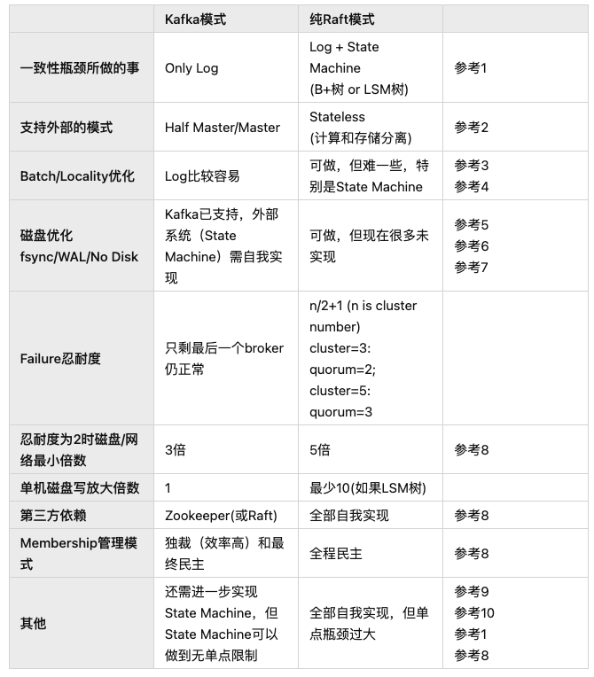

IAM policy

rules that, under the correct 'condition', 
define what 'actions' the policy 'principal' or holder
can take to specify AWS 'resources'

'who': user/group/role, role allow svc like EC2 to become the 'who'
'what': run instance/CRUD/plug to other svc
'which', I can access S3, but which one or all of them?
'when', when this rule should apply

Gotcha:
If making and attaching policy to IAM principle, the principal can be optional and default to that 'who'
but why we even need a principle? because some of policy are not attached to IAM users, could be resource.
like S3 bucket, SNS, SQS, and Role trust policy. It is not 'who can do which', rather 'which allow who'
bucket policy is just policy that need principal,

the who user and the who resouce
what's the difference between attaching a policy to an IAM user vs resouce like S3 bucket?
permission slip: the user carry the paperwork can access
VIP list: the user carry nothing but identity, the vault have the paperwork list.

iam role::assumeRole
user and groups have actual 'who', but not iam.
iam role will solid only after 'trust policy': who can assume this role.
when creating a iam role in the aws console, a trust policy will generated when we select 'Role Type'

passrole:

2022 review
velox
Language Frontend -> IR -> Optimizer -> Execution Engine -> Execution Runtime
------PostgreSQL ------      (策略)           velox           (硬件调校)

ReadySet
Jon Gjengset: Partial State in Dataflow-Based Materialized Views 
cache that understand SQL
https://planetscale.com/blog/how-planetscale-boost-serves-your-sql-queries-instantly

Neon
PostgreSQL 版的 PlanetScale, branching?

Google AlloyDB
基于 PostgreSQL 协议的 AlloyDB，整体架构是 AWS Aurora 的升级版
AlloyDB 采取了和 Aurora, Neon 类似的基于 WAL 的存算分离架构，不过 AlloyDB 在 TP 基础上先点了 AP 的技能树

* 原生 (vanilla) OLTP MySQL, PostgreSQL, SQL Server - Cloud SQL。
* 云原生数仓 OLAP - BigQuery。
* 云原生分布式 OLTP 数据库 - Cloud Spanner

Snowflake Unistore
HTAP to TP
公司总是先有 TP 系统, TP 是在线系统，AP 是离线系统

LiteFS and Cloudflare D1

AP类的DuckDB

PostgreSQL = MySQL + 穷人版 (ClickHouse + MongoDB + Elasticsearch + InfluxDB) + Geospatial + Multi-tenancy

DataZone

SQL 语言统一，执行引擎统一，基于日志的存储统一

当下数据库痛点的瓶颈：
如何基于云底座实现扎实的 serverless 形态，存算分离，spot instance，tiered storage，给云上的多租户提供高性价比的数据库服务。

如何把 TP，AP 甚至数据湖结合在一起。

如何让数据库变更的开发工作流更接近代码变更的工作流。

